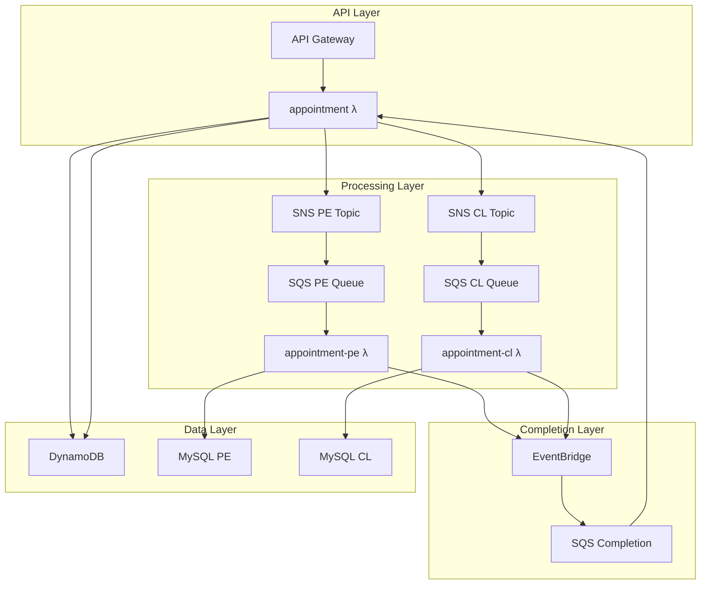

# 🏥 Sistema de Agendamiento de Citas Médicas

## 📋 Tabla de Contenidos
- [Descripción General](#-descripción-general)
- [Para Usuarios No Técnicos](#-para-usuarios-no-técnicos)
- [Para Desarrolladores](#-para-desarrolladores)
- [Arquitectura del Sistema](#-arquitectura-del-sistema)
- [API Endpoints](#-api-endpoints)
- [Flujos de Negocio](#-flujos-de-negocio)
- [Infraestructura](#-infraestructura)
- [Despliegue](#-despliegue)
- [Monitoreo](#-monitoreo)

---

## 🎯 Descripción General

### ¿Qué hace este sistema?
El **Sistema de Agendamiento de Citas Médicas** permite a los asegurados agendar citas médicas de forma automática y eficiente. El sistema maneja dos países: **Perú (PE)** y **Chile (CL)**, cada uno con su propio proceso de agendamiento.

### Características Principales
- ✅ **Agendamiento Asíncrono**: Las citas se procesan en segundo plano
- ✅ **Multi-País**: Soporte para Perú y Chile con lógicas específicas
- ✅ **Alta Disponibilidad**: Arquitectura serverless sin puntos únicos de falla
- ✅ **Escalabilidad**: Se adapta automáticamente a la demanda
- ✅ **Trazabilidad**: Seguimiento completo del estado de las citas
- ✅ **Validación Robusta**: Verificación estricta de datos de entrada

---

## 👥 Para Usuarios No Técnicos

### ¿Cómo funciona el agendamiento?

#### 1. **Solicitud de Cita** 📅
Un asegurado envía una solicitud con:
- **Código de asegurado** (5 dígitos)
- **ID del horario** disponible
- **País** (PE o CL)

#### 2. **Confirmación Inmediata** ⚡
El sistema responde inmediatamente:
```json
{
  "appointmentId": "uuid-de-la-cita",
  "message": "Appointment scheduling is in process",
  "status": "pending"
}
```

#### 3. **Procesamiento Automático** 🔄
- El sistema guarda la solicitud como **"pendiente"**
- Envía la información al sistema específico del país
- El país procesa la cita según sus reglas
- La cita se marca como **"programada"** en el sistema del país
- Finalmente se actualiza a **"completada"** en el sistema principal

#### 4. **Consulta de Estado** 📊
Los asegurados pueden consultar sus citas en cualquier momento usando su código de asegurado.

### Estados de las Citas
| Estado | Descripción | ¿Qué significa? |
|--------|-------------|-----------------|
| `pending` | Pendiente | La solicitud fue recibida y está siendo procesada |
| `scheduled` | Programada | La cita fue programada en el sistema del país |
| `completed` | Completada | Todo el proceso finalizó exitosamente |

### Beneficios del Sistema
- **Respuesta Rápida**: Confirmación inmediata de recepción
- **Procesamiento Confiable**: Manejo automático de errores y reintentos
- **Transparencia**: Estado visible en tiempo real
- **Disponibilidad 24/7**: Funciona sin interrupciones

---

## 👨‍💻 Para Desarrolladores

### Stack Tecnológico
- **Runtime**: Node.js 18.x TypeScript
- **Framework**: Serverless Framework
- **Arquitectura**: Clean Architecture + SOLID Principles
- **Cloud**: AWS (Lambda, DynamoDB, SNS, SQS, EventBridge, RDS)
- **Base de Datos**: DynamoDB (principal), MySQL/RDS (por país)
- **Testing**: Jest con >90% coverage
- **Validación**: Zod schemas

### Estructura del Proyecto
```
scheduling-medical-appointment/
├── functions/                    # 📱 Presentation Layer
│   ├── appointment/             # Handler principal API + SQS
│   ├── appointment-pe/          # Procesador Perú
│   ├── appointment-cl/          # Procesador Chile
│   └── shared/                  # Utilidades comunes
├── libs/
│   ├── core/
│   │   ├── domain/             # 🏗️ Domain Layer (entidades, value objects)
│   │   └── use-cases/          # 🎯 Application Layer (casos de uso)
│   ├── infrastructure/         # 🔧 Infrastructure Layer (adapters)
│   └── shared/                 # Utilidades compartidas
├── resources/                  # 🏛️ Infrastructure as Code (AWS)
└── test/                      # 🧪 E2E Tests
```

### Patrones de Diseño Implementados
- **🏭 Factory Pattern**: Para creación de dependencias
- **🗃️ Repository Pattern**: Para abstracción de persistencia
- **🔌 Adapter Pattern**: Para integración con AWS services
- **🎯 Use Case Pattern**: Para lógica de negocio
- **🏗️ Builder Pattern**: Para construcción de entidades complejas

---

## 🏗️ Arquitectura del Sistema

### Diagrama de Alto Nivel


### Capas de la Arquitectura Limpia

#### 🎯 **Application Layer** (Use Cases)
```typescript
// Casos de uso principales
CreateAppointmentUseCase        // POST /appointments
GetAppointmentsByInsuredIdUseCase  // GET /appointments/{id}
ProcessCountryAppointmentUseCase   // Procesamiento por país
CompleteAppointmentUseCase      // Finalización de citas
```

#### 🏗️ **Domain Layer** (Business Logic)
```typescript
// Entidades principales
Appointment     // Cita médica
Schedule        // Horario disponible
Insured         // Asegurado

// Value Objects
AppointmentId   // ID único de cita
InsuredId       // ID de asegurado (5 dígitos)
CountryISO      // País (PE/CL)
```

#### 🔧 **Infrastructure Layer** (External Services)
```typescript
// Repositorios
DynamoDBAppointmentRepository   // DynamoDB operations
MySQLAppointmentRepository      // MySQL operations
MySQLScheduleRepository         // Schedule operations

// Adapters
SNSAdapter                      // Messaging
EventBridgeAdapter             // Event publishing
```

#### 📱 **Presentation Layer** (Functions)
```typescript
// Handlers
appointment/handler.ts          // API Gateway + SQS main
appointment-pe/handler.ts       // Peru processor
appointment-cl/handler.ts       // Chile processor
```

---

## 🔌 API Endpoints

### 📝 POST /appointments
**Crear nueva cita médica**

#### Request
```http
POST https://api.medical-appointments.com/appointments
Content-Type: application/json

{
  "insuredId": "12345",
  "scheduleId": 100,
  "countryISO": "PE"
}
```

#### Validaciones
- **insuredId**: Exactamente 5 dígitos (se auto-completa con ceros)
- **scheduleId**: Número entero positivo
- **countryISO**: Solo "PE" o "CL"

#### Response (201 Created)
```json
{
  "appointmentId": "550e8400-e29b-41d4-a716-446655440000",
  "message": "Appointment scheduling is in process",
  "status": "pending"
}
```

#### Errores Posibles
```json
// 400 Bad Request - Validation Error
{
  "error": {
    "message": "Validation failed",
    "errorCode": "VALIDATION_ERROR",
    "fields": {
      "countryISO": [
        {
          "message": "Country must be PE or CL",
          "code": "invalid_enum_value"
        }
      ]
    }
  }
}

// 404 Not Found - Schedule Not Found
{
  "error": {
    "message": "Schedule not found",
    "errorCode": "NOT_FOUND"
  }
}

// 500 Internal Server Error
{
  "error": {
    "message": "Internal server error",
    "errorCode": "INTERNAL_ERROR"
  }
}
```

### 📋 GET /appointments/{insuredId}
**Consultar citas por asegurado**

#### Request
```http
GET https://api.medical-appointments.com/appointments/12345?status=pending&limit=20&offset=0&startDate=2024-01-01T00:00:00Z&endDate=2024-12-31T23:59:59Z
```

#### Query Parameters
| Parameter | Type | Required | Default | Description |
|-----------|------|----------|---------|-------------|
| `status` | enum | No | - | Filtrar por estado: "pending", "scheduled", "completed" |
| `limit` | number | No | 20 | Número de resultados (1-100) |
| `offset` | number | No | 0 | Offset para paginación |
| `startDate` | ISO Date | No | - | Fecha inicio (ISO 8601) |
| `endDate` | ISO Date | No | - | Fecha fin (ISO 8601) |

#### Response (200 OK)
```json
{
  "appointments": [
    {
      "appointmentId": "550e8400-e29b-41d4-a716-446655440000",
      "insuredId": "12345",
      "countryISO": "PE",
      "status": "completed",
      "createdAt": "2024-09-15T10:30:00Z",
      "updatedAt": "2024-09-15T10:35:00Z",
      "processedAt": "2024-09-15T10:35:00Z",
      "schedule": {
        "scheduleId": 100,
        "centerId": 1,
        "specialtyId": 3,
        "medicId": 4,
        "date": "2024-09-20T14:30:00Z"
      }
    }
  ],
  "pagination": {
    "count": 1,
    "total": 5,
    "limit": 20,
    "offset": 0,
    "hasMore": false,
    "totalPages": 1,
    "currentPage": 1
  },
  "filters": {
    "status": null,
    "startDate": null,
    "endDate": null
  },
  "meta": {
    "totalAvailable": 5,
    "totalFiltered": 5,
    "filterApplied": false
  }
}
```

---

## 🔄 Flujos de Negocio

### Flujo de Creación de Cita

#### 1. **Recepción y Validación** (0-100ms)
```typescript
// functions/appointment/route-handlers.ts
handleCreateAppointment() {
  // 1. Validación robusta con Zod
  const validation = HTTPValidator.validateBody(event, CreateAppointmentBodySchema);
  if (!validation.isValid) return validationError;
  
  // 2. Datos tipados y transformados automáticamente
  const requestBody = validation.data; // Fully typed & validated
}
```

#### 2. **Caso de Uso de Creación** (100-500ms)
```typescript
// libs/core/use-cases/src/create-appointment/create-appointment.use-case.ts
async execute(dto: CreateAppointmentDto) {
  // 1. Crear value objects con validación de dominio
  const insuredId = InsuredId.fromString(dto.insuredId);
  const countryISO = CountryISO.fromString(dto.countryISO);
  
  // 2. Validar que el schedule existe
  const schedule = await this.scheduleRepository.findByScheduleId(dto.scheduleId, countryISO);
  
  // 3. Crear entidad de dominio
  const appointment = Appointment.create({ insured, schedule });
  
  // 4. Persistir en DynamoDB (status: "pending")
  await this.appointmentRepository.save(appointment);
  
  // 5. Publicar evento a SNS del país correspondiente
  await this.messagingPort.publishToCountrySpecificTopic(appointmentData, countryISO);
  
  return { appointmentId, status: "pending" };
}
```

#### 3. **Mensajería y Distribución** (500ms-2s)
```
appointment λ → SNS PE/CL Topic → SQS PE/CL Queue → appointment-pe/cl λ
```

#### 4. **Procesamiento por País** (2-10s)
```typescript
// libs/core/use-cases/src/process-country-appointment/process-country-appointment.use-case.ts
async execute(dto: ProcessCountryAppointmentDto) {
  // 1. Obtener información del schedule
  const schedule = await this.scheduleRepository.findByScheduleId(dto.scheduleId, countryISO);
  
  // 2. Crear appointment para MySQL
  const countryAppointment = Appointment.fromPrimitives({
    appointmentId: dto.appointmentId,
    status: 'scheduled',
    processedAt: new Date()
  });
  
  // 3. Aplicar lógica específica del país
  await this.processCountrySpecificLogic(countryAppointment, countryISO);
  
  // 4. Guardar en MySQL del país (appointment_pe / appointment_cl)
  await this.countryAppointmentRepository.save(countryAppointment);
  
  // 5. Reservar el slot del schedule
  await this.scheduleRepository.markAsReserved(dto.scheduleId, countryISO);
  
  // 6. Publicar evento de completado a EventBridge
  await this.eventBus.publish(new AppointmentProcessedEvent(dto));
}
```

#### 5. **Finalización Automática** (10-15s)
```
EventBridge → SQS Completion → appointment λ (SQS handler) → CompleteAppointmentUseCase
```

```typescript
// libs/core/use-cases/src/complete-appointment/complete-appointment.use-case.ts
async execute(dto: CompleteAppointmentDto) {
  // 1. Buscar appointment en DynamoDB
  const appointment = await this.appointmentRepository.findByAppointmentId(appointmentId);
  
  // 2. Marcar como completada
  appointment.markAsCompleted();
  
  // 3. Actualizar en DynamoDB (status: "completed")
  await this.appointmentRepository.update(appointment);
  
  // 4. Publicar evento final
  await this.eventBus.publish(new AppointmentCompletedEvent(appointment));
}
```

### Flujo de Consulta de Citas

#### 1. **Validación de Consulta**
```typescript
// Validación del insuredId en path y query parameters
const pathValidation = HTTPValidator.validatePathParams(event, GetAppointmentsPathSchema);
const queryValidation = HTTPValidator.validateQueryParams(event, GetAppointmentsQuerySchema);
```

#### 2. **Consulta Multi-Source**
```typescript
// libs/core/use-cases/src/get-appointments/get-appointments.use-case.ts
async execute(dto: GetAppointmentsDto) {
  // Consultar ambas fuentes en paralelo
  const [dynamoAppointments, mysqlAppointments] = await Promise.all([
    this.dynamoDbRepository.findByInsuredId(insuredId),
    this.mysqlRepository.findByInsuredId(insuredId)
  ]);
  
  // Combinar y deduplicar resultados
  const allAppointments = [...dynamoAppointments, ...mysqlAppointments];
  const uniqueAppointments = this.removeDuplicateAppointments(allAppointments);
  
  return { appointments: uniqueAppointments };
}
```

#### 3. **Filtrado y Paginación**
```typescript
// En el route handler
let filteredAppointments = result.appointments;

// Aplicar filtros
if (queryParams.status) {
  filteredAppointments = filteredAppointments.filter(apt => apt.status === queryParams.status);
}

// Aplicar paginación
const paginatedAppointments = filteredAppointments.slice(offset, offset + limit);
```

---

## 🏛️ Infraestructura

### AWS Services Utilizados

#### **🔧 Compute**
- **AWS Lambda**: 3 funciones serverless
  - `appointment`: Handler principal (API + SQS)
  - `appointment-pe`: Procesador de Perú
  - `appointment-cl`: Procesador de Chile

#### **🗄️ Storage**
- **DynamoDB**: Base de datos principal
  - Tabla: `Appointments`
  - GSI: `insuredId-index` para consultas rápidas
  - Encriptación en reposo
- **RDS MySQL**: Base de datos por país
  - Tablas: `appointment_pe`, `appointment_cl`
  - Conexión via VPC

#### **📨 Messaging**
- **SNS (Simple Notification Service)**: 3 topics
  - `appointments-main`: Topic principal
  - `appointments-pe`: Topic específico de Perú
  - `appointments-cl`: Topic específico de Chile
- **SQS (Simple Queue Service)**: 3 queues + DLQs
  - `appointments-pe-queue`: Cola de Perú
  - `appointments-cl-queue`: Cola de Chile
  - `appointments-completion-queue`: Cola de finalización
- **EventBridge**: Event bus para completion events

#### **🌐 API & Security**
- **API Gateway**: Punto de entrada HTTP/REST
- **IAM**: Roles y políticas específicas por servicio
- **KMS**: Encriptación de mensajes SQS
- **CloudWatch**: Logs y métricas

### Configuración de Recursos

#### DynamoDB Table Design
```yaml
Table: Appointments
Partition Key: appointmentId (String)
GSI: insuredId-index
  - Partition Key: insuredId (String)
  - Sort Key: createdAt (String)

Attributes:
  - appointmentId: "uuid-v4"
  - insuredId: "12345" (5 digits)
  - countryISO: "PE" | "CL"
  - scheduleId: number
  - status: "pending" | "completed"
  - schedule: { complete schedule object }
  - createdAt: ISO timestamp
  - updatedAt: ISO timestamp
  - processedAt: ISO timestamp | null
```

#### MySQL Schema
```sql
-- Table: appointment_pe
CREATE TABLE appointment_pe (
  appointment_id VARCHAR(36) PRIMARY KEY,
  insured_id VARCHAR(5) NOT NULL,
  schedule_id INT NOT NULL,
  country_iso CHAR(2) NOT NULL DEFAULT 'PE',
  center_id INT NOT NULL,
  specialty_id INT NOT NULL,
  medic_id INT NOT NULL,
  appointment_date DATETIME NOT NULL,
  status VARCHAR(20) NOT NULL DEFAULT 'scheduled',
  created_at TIMESTAMP DEFAULT CURRENT_TIMESTAMP,
  updated_at TIMESTAMP DEFAULT CURRENT_TIMESTAMP ON UPDATE CURRENT_TIMESTAMP,
  
  INDEX idx_insured_id (insured_id),
  INDEX idx_appointment_date (appointment_date),
  INDEX idx_status (status)
);

-- Table: appointment_cl (same structure with country_iso = 'CL')
```

#### SNS → SQS Integration
```yaml
# Direct country-specific routing
SNS PE Topic → SQS PE Queue → Lambda PE
SNS CL Topic → SQS CL Queue → Lambda CL

# Completion flow
EventBridge → SQS Completion → Lambda Appointment
```

### Environment Configuration

#### Development
```yaml
# config/dev.yml
logging:
  level: DEBUG
  retentionDays: 7
security:
  encryption:
    sqsKmsKeyId: alias/aws/sqs
database:
  mysql:
    connectionLimit: 5
```

#### Production
```yaml
# config/prod.yml
logging:
  level: INFO
  retentionDays: 30
security:
  encryption:
    sqsKmsKeyId: !Ref CustomKMSKey
database:
  mysql:
    connectionLimit: 20
```

---

## 🚀 Despliegue

### Prerequisitos
```bash
# Node.js y npm
node --version  # v18.x
npm --version   # v9.x

# Serverless Framework
npm install -g serverless
serverless --version  # v3.x

# AWS CLI configurado
aws configure list
```

### Scripts de Despliegue

#### 1. **Instalación de Dependencias**
```bash
# Root level
npm install

# Function level dependencies
npm run install:functions
```

#### 2. **Build del Proyecto**
```bash
# Compile TypeScript
npm run build

# Run tests
npm test

# Check coverage
npm run test:coverage
```

#### 3. **Despliegue por Ambiente**
```bash
# Development
npm run deploy:dev
# Equivale a: serverless deploy --stage dev --region us-east-1

# Staging
npm run deploy:staging

# Production
npm run deploy:prod
```

#### 4. **Despliegue de Infraestructura**
```bash
# Deploy infrastructure stack first
cd infrastructure
serverless deploy --stage dev

# Then deploy application
cd ..
npm run deploy:dev
```

### CI/CD Pipeline

#### GitHub Actions Workflow
```yaml
# .github/workflows/deploy.yml
name: Deploy Medical Appointments API

on:
  push:
    branches: [main, develop]
  pull_request:
    branches: [main]

jobs:
  test:
    runs-on: ubuntu-latest
    steps:
      - name: Checkout
        uses: actions/checkout@v3
      
      - name: Setup Node.js
        uses: actions/setup-node@v3
        with:
          node-version: 18
          cache: npm
      
      - name: Install dependencies
        run: npm ci
      
      - name: Run tests
        run: npm test
      
      - name: Check coverage
        run: npm run test:coverage

  deploy-dev:
    needs: test
    if: github.ref == 'refs/heads/develop'
    runs-on: ubuntu-latest
    steps:
      - name: Deploy to Development
        run: npm run deploy:dev

  deploy-prod:
    needs: test
    if: github.ref == 'refs/heads/main'
    runs-on: ubuntu-latest
    steps:
      - name: Deploy to Production
        run: npm run deploy:prod
```

### Verificación Post-Despliegue
```bash
# Test API endpoints
npm run test:e2e

# Check AWS resources
aws lambda list-functions --query 'Functions[?contains(FunctionName, `medical-appointment`)].FunctionName'

# Monitor logs
serverless logs --function appointment --tail
```

---

## 📊 Monitoreo

### CloudWatch Dashboards

#### Métricas Principales
```json
{
  "metrics": [
    "AWS/Lambda/Duration",
    "AWS/Lambda/Errors", 
    "AWS/Lambda/Invocations",
    "AWS/DynamoDB/ConsumedReadCapacityUnits",
    "AWS/DynamoDB/ConsumedWriteCapacityUnits",
    "AWS/SNS/NumberOfMessagesPublished",
    "AWS/SQS/ApproximateNumberOfMessages"
  ]
}
```

#### Alertas Configuradas
- **Lambda Errors > 5 in 5 minutes**
- **DynamoDB Throttling > 0**
- **SQS Dead Letter Queue > 0**
- **API Gateway 5xx Errors > 1%**

### Logging Strategy

#### Structured Logging
```typescript
// Ejemplo de log estructurado
logger.info('Appointment created successfully', {
  logId: 'appointment-created-success',
  appointmentId: result.appointmentId,
  insuredId: maskInsuredId(dto.insuredId), // PII masking
  countryISO: dto.countryISO,
  requestId: context.awsRequestId
});
```

#### Log Levels
- **ERROR**: Errores críticos que requieren atención inmediata
- **WARN**: Situaciones inesperadas pero manejables
- **INFO**: Eventos importantes del negocio
- **DEBUG**: Información detallada para troubleshooting

### Health Checks

#### API Health Endpoint
```http
GET /health
Response: {
  "status": "healthy",
  "version": "1.0.0",
  "timestamp": "2024-09-15T10:30:00Z",
  "dependencies": {
    "dynamodb": "healthy",
    "mysql": "healthy",
    "sns": "healthy"
  }
}
```

#### Monitoring Queries
```bash
# Check Lambda performance
aws logs filter-log-events \
  --log-group-name /aws/lambda/medical-appointment-scheduling-dev-appointment \
  --filter-pattern "ERROR"

# Check SQS queue depth
aws sqs get-queue-attributes \
  --queue-url https://sqs.region.amazonaws.com/account/queue-name \
  --attribute-names ApproximateNumberOfMessages
```

---

## 📚 Referencias Adicionales

### Documentación Técnica
- [API Specification (OpenAPI/Swagger)](/docs/swagger.json)
- [Infrastructure Documentation](/docs/INFRASTRUCTURE.md)
- [Testing Guide](/test/README.md)

### Arquitectura y Patrones
- [Clean Architecture by Robert C. Martin](https://blog.cleancoder.com/uncle-bob/2012/08/13/the-clean-architecture.html)
- [Domain-Driven Design](https://martinfowler.com/tags/domain%20driven%20design.html)
- [Serverless Patterns](https://serverlesspatterns.io/)

### AWS Services
- [AWS Lambda Best Practices](https://docs.aws.amazon.com/lambda/latest/dg/best-practices.html)
- [DynamoDB Best Practices](https://docs.aws.amazon.com/amazondynamodb/latest/developerguide/best-practices.html)
- [EventBridge Patterns](https://docs.aws.amazon.com/eventbridge/latest/userguide/eb-event-patterns.html)

---

## 🤝 Soporte

### Reportar Problemas
- **GitHub Issues**: [Repository URL]/issues
- **Slack Channel**: #medical-appointments-support

### Contribución
1. Fork el repositorio
2. Crear feature branch: `git checkout -b feature/nueva-funcionalidad`
3. Commit cambios: `git commit -m 'Add nueva funcionalidad'`
4. Push branch: `git push origin feature/nueva-funcionalidad`
5. Crear Pull Request

---

**📅 Última actualización**: Septiembre 2024  
**🔄 Versión del documento**: 1.0.0  
**📝 Mantenido por**: Equipo de Desarrollo Medical Appointments
