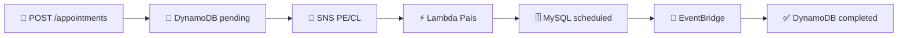
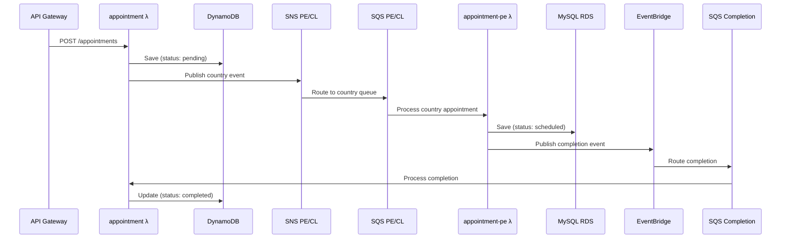

# 🏥 Medical Appointment Scheduling API

[](https://github.com/kedeinroga/medical-appointment-scheduling/actions)
[](./coverage/index.html)
[](https://www.typescriptlang.org/)
[](https://www.serverless.com/)
[](https://aws.amazon.com/)

Un sistema robusto de agendamiento de citas médicas construido con **Serverless Framework**, **TypeScript**, **Node.js** y servicios **AWS**, implementando principios de **Arquitectura Limpia** y patrones **SOLID**.

## 📋 Tabla de Contenidos

- [🚀 Descripción General](#-descripción-general)
- [🏗️ Arquitectura](#️-arquitectura)
- [📁 Estructura del Proyecto](#-estructura-del-proyecto)
- [⚡ Inicio Rápido](#-inicio-rápido)
- [🔧 Desarrollo](#-desarrollo)
- [🧪 Testing](#-testing)
- [📡 Documentación de API](#-documentación-de-api)
- [🏗️ Infraestructura](#️-infraestructura)
- [📊 Monitoreo](#-monitoreo)
- [🤝 Contribuciones](#-contribuciones)

## 🚀 Descripción General

### ¿Qué hace este sistema?
Sistema de agendamiento de citas médicas que maneja **múltiples países** (Perú y Chile) usando una **arquitectura orientada a eventos** con servicios serverless de AWS. El sistema procesa solicitudes de citas de forma **asíncrona** y mantiene consistencia de datos entre diferentes bases de datos regionales.

### Flujo de Negocio Simplificado



**Estados de Citas:**
- `pending` → Solicitud recibida y en proceso
- `scheduled` → Programada en el sistema del país  
- `completed` → Proceso finalizado exitosamente

### Características Principales
- ✅ **Arquitectura Limpia**: Separación clara de responsabilidades
- ✅ **Event-Driven**: Comunicación asíncrona via eventos
- ✅ **Multi-País**: Soporte nativo para PE y CL con lógicas específicas
- ✅ **Alta Disponibilidad**: Sin puntos únicos de falla
- ✅ **Escalabilidad Automática**: Se adapta a la demanda
- ✅ **Validación Robusta**: Schemas Zod con tipado fuerte
- ✅ **Monitoreo Completo**: Logs estructurados y métricas
- ✅ **Testing Exhaustivo**: +90% cobertura de código

### Patrones Implementados

#### 🔧 SOLID Principles
- **S**ingle Responsibility: Cada clase una responsabilidad específica
- **O**pen/Closed: Extensible via interfaces y abstracciones
- **L**iskov Substitution: Implementaciones intercambiables de repositorios
- **I**nterface Segregation: Interfaces específicas por responsabilidad
- **D**ependency Inversion: Dependencia en abstracciones, no concreciones

#### 🏗️ Design Patterns
- **Repository Pattern**: Abstracción de persistencia
- **Factory Pattern**: Creación de casos de uso y dependencias
- **Adapter Pattern**: Integración con servicios AWS
- **Use Case Pattern**: Encapsulación de lógica de negocio
- **Event-Driven Pattern**: Comunicación vía eventos de dominio

## 🏗️ Arquitectura

### Clean Architecture Layers

```
┌─────────────────────────────────────────────────────────────┐
│                   📱 Functions Layer                        │
│                 (Lambda Handlers - AWS)                     │
├─────────────────────────────────────────────────────────────┤
│                🔧 Infrastructure Layer                      │
│            (Adapters - DynamoDB, SNS, MySQL)               │
├─────────────────────────────────────────────────────────────┤
│                  🎯 Application Layer                       │
│                   (Use Cases)                               │
├─────────────────────────────────────────────────────────────┤
│                   🏢 Domain Layer                           │
│             (Entities & Business Logic)                     │
└─────────────────────────────────────────────────────────────┘
```

### Tech Stack
- **Runtime**: Node.js 18.x ARM64
- **Language**: TypeScript 5.0+
- **Framework**: Serverless Framework 3.x
- **Cloud**: AWS (Lambda, DynamoDB, SNS, SQS, EventBridge, RDS)
- **Testing**: Jest + >90% coverage
- **Validation**: Zod schemas
- **Architecture**: Hexagonal/Clean Architecture + DDD
- **CI/CD**: GitHub Actions + AWS

### AWS Services

| Servicio | Propósito | Configuración |
|----------|-----------|---------------|
| **🌐 API Gateway** | REST API endpoints | CORS, throttling, validation |
| **⚡ Lambda (3)** | Compute serverless | appointment, appointment-pe, appointment-cl |
| **💾 DynamoDB** | Storage principal | Tabla Appointments + GSI |
| **📨 SNS (3)** | Message distribution | Topics por país + main |
| **📋 SQS (3)** | Message queuing | Colas PE, CL, completion + DLQ |
| **🔔 EventBridge** | Event routing | Bus personalizado + rules |
| **🗄️ RDS MySQL** | Storage por país | Tablas appointment_pe, appointment_cl |
| **🔐 IAM** | Security & permissions | Roles específicos por servicio |

## 📁 Estructura del Proyecto

```
medical-appointment-scheduling/
├── 📄 serverless.yml                 # Configuración principal IaC
├── 📄 package.json                   # Dependencies & scripts raíz
├── 📄 PROJECT-DOCUMENTATION.md       # 📖 Documentación completa
│
├── 📁 functions/                     # 📱 Lambda Handlers (Presentation)
│   ├── 📁 appointment/               # API principal + completion
│   │   ├── handler.ts                # Main handler (API + SQS)
│   │   ├── route-handlers.ts         # Robust validation & routing
│   │   ├── constants.ts              # Handler constants
│   │   └── __tests__/                # Function tests
│   ├── 📁 appointment-pe/            # Procesador Perú
│   ├── 📁 appointment-cl/            # Procesador Chile
│   └── 📁 shared/                    # Utilities comunes
│
├── 📁 infrastructure/                # 🔌 Infrastructure as Code (IaC)
│   ├── 📁 resources/                 # 📦 Cloud resources
│   │   ├── outputs.yml               # CloudFormation outputs
│   │   ├── parameter-store.yml       # DynamoDB tables
│   │   ├── rds.yml                   # RDS instances
│   │   └── s3.yml                    # S3 buckets
│   ├── 📁 scripts/                   # 🔨 Deployment & utility scripts
│   │   ├── create-database.sql       # Database creation script
│   │   └── seed-data.sql             # Database seeding script
│   └── serverless.yml                # Infrastructure stack
│
├── 📁 libs/                          # 🏗️ Clean Architecture Layers
│   ├── 📁 core/
│   │   ├── 📁 domain/                # 🏢 Business entities & rules
│   │   │   ├── entities/             # Appointment, Schedule, Insured
│   │   │   ├── value-objects/        # AppointmentId, CountryISO
│   │   │   ├── ports/                # Repository interfaces
│   │   │   └── events/               # Domain events
│   │   └── 📁 use-cases/             # 🎯 Application logic
│   │       ├── create-appointment/   # POST /appointments logic
│   │       ├── get-appointments/     # GET /appointments/{id} logic
│   │       ├── process-country-appointment/  # Country processing
│   │       ├── complete-appointment/ # Completion logic
│   │       └── factories/            # Dependency injection
│   ├── 📁 infrastructure/            # 🔧 AWS Adapters
│   │   ├── adapters/
│   │   │   ├── repositories/         # DynamoDB, MySQL implementations
│   │   │   └── messaging/            # SNS, EventBridge adapters
│   │   ├── config/                   # AWS configuration
│   │   └── factories/                # Infrastructure factories
│   └── 📁 shared/                    # 🔄 Common utilities
│
├── 📁 resources/                     # 🏛️ Infrastructure as Code
│   ├── api-gateway.yml               # API Gateway config
│   ├── dynamodb.yml                  # DynamoDB tables
│   ├── sns.yml                       # SNS topics (3)
│   ├── sqs.yml                       # SQS queues (3) + DLQ
│   ├── eventbridge.yml               # EventBridge rules
│   └── iam.yml                       # IAM roles & policies
│
├── 📁 config/                        # ⚙️ Environment configs
│   ├── dev.yml                       # Development
│   ├── staging.yml                   # Staging  
│   └── prod.yml                      # Production
│
├── 📁 test/                          # 🧪 Testing
│   ├── e2e/                          # End-to-end tests
│   └── integration/                  # Integration tests
│
├── 📁 docs/                          # 📖 Documentation
│   ├── openapi.yml                   # OpenAPI/Swagger spec
│   └── INFRASTRUCTURE.md             # Infrastructure docs
│
└── 📁 static/                        # 📋 Business docs
    ├── REQUIREMENTS.md               # Business requirements
    └── diagrama.png                  # Architecture diagram
```

## ⚡ Inicio Rápido

### Prerequisites

```bash
# Verificar versiones requeridas
node --version    # >= 18.0.0
npm --version     # >= 8.0.0
aws --version     # >= 2.0.0

# Instalar Serverless Framework
npm install -g serverless@3

# Verificar configuración AWS
aws configure list
```

### Instalación

```bash
# 1. Clonar repositorio
git clone https://github.com/kedeinroga/medical-appointment-scheduling.git
cd medical-appointment-scheduling

# 2. Instalar dependencias
npm install

# 3. Build del proyecto
npm run build

# 4. Ejecutar tests
npm test
```

### Despliegue Rápido

```bash
# Development
npm run deploy:dev

# Production
npm run deploy:prod

# Verificar despliegue
npm run test:e2e
```

## 🔧 Desarrollo

### Scripts Disponibles

```bash
# 🏗️ Build & Development
npm run build                # Build completo
npm run build:functions      # Solo functions
npm run clean               # Limpiar artifacts

# 🧪 Testing
npm test                    # Todos los tests
npm run test:unit           # Unit tests
npm run test:integration    # Integration tests  
npm run test:coverage       # Con reporte de coverage
npm run test:watch          # Watch mode
npm run test:e2e           # End-to-end tests

# 🚀 Deployment
npm run deploy:dev          # Deploy a development
npm run deploy:staging      # Deploy a staging
npm run deploy:prod         # Deploy a production

# 🛠️ Utilities
npm run logs:appointment    # Ver logs function principal
npm run logs:pe            # Ver logs Peru processor
npm run logs:cl            # Ver logs Chile processor
npm run start:local        # Serverless offline
npm run lint               # ESLint check
npm run lint:fix           # ESLint auto-fix
```

### Desarrollo Local

```bash
# Iniciar desarrollo local
npm run start:local

# API disponible en:
# http://localhost:3000

# Endpoints locales:
# POST http://localhost:3000/dev/appointments
# GET  http://localhost:3000/dev/appointments/{insuredId}
```

### Environment Variables

```yaml
# config/dev.yml - Configuración de desarrollo
logging:
  level: DEBUG
  retentionDays: 7

database:
  mysql:
    connectionLimit: 5

api:
  throttling:
    rateLimit: 100
    burstLimit: 200

# Variables de entorno principales:
STAGE: dev
LOG_LEVEL: DEBUG
APPOINTMENTS_TABLE_NAME: appointments-table-dev
RDS_HOST: dev-medical-rds.cluster-xxxxx.us-east-1.rds.amazonaws.com
```

## 🧪 Testing

### Cobertura de Tests

| Layer | Coverage | Files | Descripción |
|-------|----------|-------|-------------|
| **🏢 Domain** | 95%+ | 15+ | Entities, Value Objects, Domain Services |
| **🎯 Application** | 90%+ | 12+ | Use Cases y orquestación |
| **🔧 Infrastructure** | 80%+ | 18+ | Adapters y integraciones AWS |
| **📱 Functions** | 85%+ | 8+ | Lambda handlers |
| **📊 Overall** | 90%+ | 50+ | Codebase completo |

### Ejecutar Tests

```bash
# Tests completos con coverage
npm run test:coverage

# Ver reporte HTML
open coverage/index.html

# Tests específicos por layer
npm test libs/core/domain         # Domain tests
npm test libs/core/use-cases      # Use case tests  
npm test libs/infrastructure      # Infrastructure tests
npm test functions/appointment    # Function tests

# Tests en modo watch
npm run test:watch

# E2E tests (requiere deploy previo)
npm run test:e2e
```

### Tipos de Tests

**🔬 Unit Tests**: Entities, Value Objects, Use Cases
**🔗 Integration Tests**: Repositories, AWS services, Database
**📱 Function Tests**: Lambda handlers, API responses
**🌐 E2E Tests**: Flujos completos de negocio

## 📡 Documentación de API

### Endpoints Disponibles

| Method | Endpoint | Descripción | Status |
|--------|----------|-------------|---------|
| `POST` | `/appointments` | Crear nueva cita | ✅ Implementado |
| `GET` | `/appointments/{insuredId}` | Obtener citas por asegurado | ✅ Implementado |

### Ejemplos de Uso

#### 📝 Crear Cita

```http
POST /appointments
Content-Type: application/json

{
  "insuredId": "12345",
  "scheduleId": 100,
  "countryISO": "PE"
}
```

**Respuesta (201 Created):**
```json
{
  "appointmentId": "550e8400-e29b-41d4-a716-446655440000",
  "message": "Appointment scheduling is in process",
  "status": "pending"
}
```

#### 📋 Consultar Citas

```http
GET /appointments/12345?status=completed&limit=10&offset=0
```

**Respuesta (200 OK):**
```json
{
  "appointments": [
    {
      "appointmentId": "550e8400-e29b-41d4-a716-446655440000",
      "insuredId": "12345",
      "countryISO": "PE",
      "status": "completed",
      "schedule": {
        "scheduleId": 100,
        "centerId": 1,
        "specialtyId": 3,
        "medicId": 4,
        "date": "2024-09-20T14:30:00Z"
      },
      "createdAt": "2024-09-15T10:30:00Z",
      "processedAt": "2024-09-15T10:35:00Z"
    }
  ],
  "pagination": {
    "count": 1,
    "total": 5,
    "limit": 10,
    "offset": 0,
    "hasMore": false,
    "totalPages": 1,
    "currentPage": 1
  },
  "filters": {
    "status": "completed",
    "startDate": null,
    "endDate": null
  }
}
```

### Validaciones API

- **insuredId**: Exactamente 5 dígitos (auto-padding con ceros)
- **scheduleId**: Número entero positivo
- **countryISO**: Solo "PE" o "CL"
- **Query filters**: status, startDate, endDate, limit (1-100), offset (≥0)

### Documentación Completa

```bash
# Ver especificación OpenAPI/Swagger
cat docs/openapi.yml

# Ver documentación completa del proyecto
cat PROJECT-DOCUMENTATION.md
```

## 🏗️ Infraestructura

### AWS Lambda Functions

| Function | Propósito | Event Sources | Responsabilidades |
|----------|-----------|---------------|-------------------|
| **`appointment`** | Handler principal | API Gateway, SQS completion | API endpoints, finalización de citas |
| **`appointment-pe`** | Procesador Perú | SQS PE queue | Lógica específica PE, MySQL PE |
| **`appointment-cl`** | Procesador Chile | SQS CL queue | Lógica específica CL, MySQL CL |

### Flujo de Datos



### Database Schema

#### DynamoDB - Appointments Table
```yaml
Partition Key: appointmentId (String)
GSI: insuredId-index
  - PK: insuredId (String)  
  - SK: createdAt (String)

Attributes:
  appointmentId: UUID v4
  insuredId: "12345" (5 digits)
  countryISO: "PE" | "CL"
  status: "pending" | "completed"
  schedule: { complete object }
  timestamps: createdAt, updatedAt, processedAt
```

#### MySQL - Country Tables
```sql
-- Tables: appointment_pe, appointment_cl
CREATE TABLE appointment_pe (
  appointment_id VARCHAR(36) PRIMARY KEY,
  insured_id VARCHAR(5) NOT NULL,
  schedule_id INT NOT NULL,
  country_iso CHAR(2) DEFAULT 'PE',
  center_id INT NOT NULL,
  specialty_id INT NOT NULL,
  medic_id INT NOT NULL,
  appointment_date DATETIME NOT NULL,
  status VARCHAR(20) DEFAULT 'scheduled',
  created_at TIMESTAMP DEFAULT CURRENT_TIMESTAMP,
  updated_at TIMESTAMP DEFAULT CURRENT_TIMESTAMP ON UPDATE CURRENT_TIMESTAMP,
  
  INDEX idx_insured_id (insured_id),
  INDEX idx_appointment_date (appointment_date)
);
```

### Comandos de Infraestructura

```bash
# Deploy completo
npm run deploy:dev

# Deploy función específica
serverless deploy function --function appointment --stage dev

# Ver información del stack
serverless info --stage dev

# Ver logs
serverless logs --function appointment --stage dev --tail

# Invocar función localmente
serverless invoke local --function appointment --path test/fixtures/create-appointment.json

# Remover stack completo
npm run remove:dev
```

## 📊 Monitoreo

### Logging Estructurado

```typescript
// Ejemplo de logging con AWS PowerTools
logger.info('Appointment created successfully', {
  logId: 'appointment-created-success',
  appointmentId: result.appointmentId,
  insuredId: maskInsuredId(dto.insuredId), // PII masking
  countryISO: dto.countryISO,
  requestId: context.awsRequestId
});
```

### Métricas CloudWatch

- **🌐 API Gateway**: Request count, latency, errors 4xx/5xx
- **⚡ Lambda**: Duration, errors, concurrent executions
- **💾 DynamoDB**: Read/write capacity, throttling
- **📋 SQS**: Message count, age, dead letter queue
- **📨 SNS**: Published messages, delivery failures

### Health Checks

```bash
# Verificar salud de la API
curl https://your-api-gateway-url/health

# Verificar logs de errores
aws logs filter-log-events \
  --log-group-name /aws/lambda/medical-appointment-scheduling-dev-appointment \
  --filter-pattern "ERROR"

# Verificar profundidad de colas SQS
aws sqs get-queue-attributes \
  --queue-url https://sqs.region.amazonaws.com/account/appointments-pe-dev \
  --attribute-names ApproximateNumberOfMessages
```

### Alertas Configuradas

- **Lambda Errors** > 5 en 5 minutos
- **DynamoDB Throttling** > 0
- **SQS Dead Letter Queue** > 0
- **API Gateway 5xx Errors** > 1%

## 🤝 Contribuciones

### Workflow de Desarrollo

```bash
# 1. Fork y clone
git clone https://github.com/your-username/medical-appointment-scheduling.git
cd medical-appointment-scheduling

# 2. Crear feature branch
git checkout -b feature/nueva-funcionalidad

# 3. Instalar y setup
npm install
npm run build

# 4. Desarrollar con tests
npm run test:watch

# 5. Verificaciones pre-commit
npm test
npm run lint
npm run test:coverage

# 6. Commit y push
git add .
git commit -m "feat: add nueva funcionalidad"
git push origin feature/nueva-funcionalidad

# 7. Crear Pull Request
```

### Estándares de Código

- **TypeScript**: Strict mode, explicit types, no `any`
- **Naming**: camelCase variables, PascalCase classes
- **Testing**: Mínimo 80% coverage para código nuevo
- **Commits**: [Conventional Commits](https://www.conventionalcommits.org/)
- **Documentation**: JSDoc para APIs públicas

### Convención de Commits

```
feat: nueva funcionalidad
fix: bug fix  
docs: cambios de documentación
style: formateo
refactor: refactoring de código
test: añadir tests
chore: tareas de mantenimiento
```

---

## 📚 Documentación Adicional

- 📖 **[Documentación Completa](PROJECT-DOCUMENTATION.md)** - Guía técnica y de negocio completa
- 🏗️ **[Documentación de Infraestructura](docs/INFRASTRUCTURE.md)** - Setup y configuración AWS
- 📋 **[Requerimientos de Negocio](static/REQUIREMENTS.md)** - Especificaciones originales
- 🔌 **[Especificación OpenAPI](docs/openapi.yml)** - Documentación de API
- 📊 **[Diagrama de Arquitectura](static/diagrama.png)** - Diagrama visual del sistema

## 🤝 Soporte

### Reportar Problemas
- **GitHub Issues**: [Repository Issues](https://github.com/kedeinroga/medical-appointment-scheduling/issues)

### Contribución
Ver [guía de contribución](#-contribuciones) arriba para detalles completos del proceso.

---

**🏥 Built with ❤️ using Clean Architecture, SOLID Principles, and AWS Serverless**

**📅 Última actualización**: Septiembre 2024  
**🔄 Versión**: 1.2.0  
**📝 Mantenido por**: Equipo de Desarrollo Medical Appointments