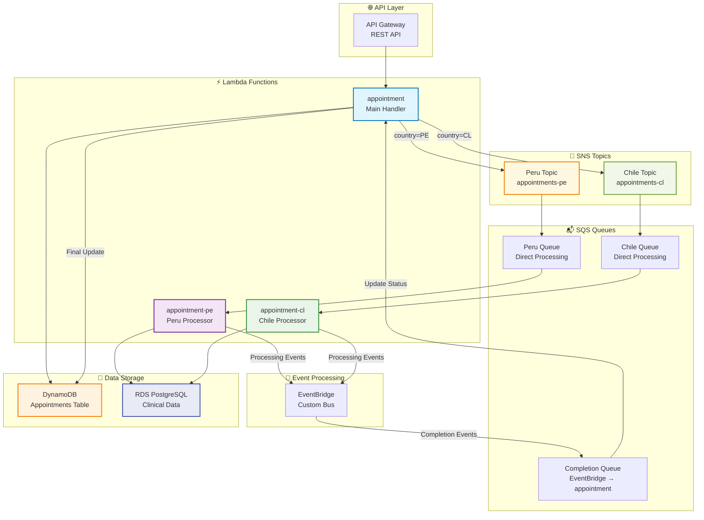

# 🏗️ Infrastructure as Code (IaC) Documentation

## 📋 Table of Contents

- [🚀 Overview](#-overview)
- [🏗️ Infrastructure Architecture](#️-infrastructure-architecture)
- [📁 Infrastructure Files Structure](#-infrastructure-files-structure)
- [🚀 Deployment Strategy](#-deployment-strategy)
- [💻 Usage](#-usage)
- [🔧 Infrastructure Components Detail](#-infrastructure-components-detail)
- [⚙️ Environment Variables](#️-environment-variables)
- [📊 Monitoring and Logging](#-monitoring-and-logging)
- [💰 Cost Optimization](#-cost-optimization)
- [🔒 Security Features](#-security-features)
- [💾 Backup and Recovery](#-backup-and-recovery)
- [🔍 Troubleshooting](#-troubleshooting)
- [🔄 Migration and Updates](#-migration-and-updates)
- [📦 Dependencies](#-dependencies)
- [📞 Support](#-support)

## 🚀 Overview

This project implements complete Infrastructure as Code using **Serverless Framework** for the Medical Appointment Scheduling system. All AWS resources are defined declaratively in YAML files, ensuring reproducible and version-controlled infrastructure deployments.

### 🎯 Key Benefits

- **Reproducible Deployments**: Infrastructure defined as code
- **Version Control**: All infrastructure changes tracked in Git
- **Environment Parity**: Consistent infrastructure across environments
- **Automated Deployments**: One-command deployment to any environment
- **Cost Optimization**: ARM64 architecture and pay-per-use billing
- **Security First**: Least privilege IAM and encryption at rest/transit

## 🏗️ Infrastructure Architecture

### 🎯 Core Components

The infrastructure consists of the following AWS services, all created through code:

| Service | Purpose | Configuration File | Resource Count |
|---------|---------|-------------------|----------------|
| **API Gateway** | REST API with throttling, validation, and CORS | `api-gateway.yml` | 1 API, 2 endpoints |
| **Lambda Functions** | 3 serverless functions for different purposes | `serverless.yml` | 3 functions |
| **DynamoDB** | Main appointments table with GSIs | `dynamodb.yml` | 1 table, 3 indexes |
| **SNS** | 3 topics - main + one per country (PE/CL) | `sns.yml` | 3 topics, 2 subscriptions |
| **SQS** | Separate queues for PE, CL, and completion | `sqs.yml` | 3 queues, 3 DLQs |
| **EventBridge** | Custom event bus for processing events | `eventbridge.yml` | 1 bus, 3 rules |
| **IAM** | Least-privilege roles and policies | `iam.yml` | 3 roles, 8 policies |
| **CloudWatch** | Log groups for monitoring and debugging | `iam.yml` | 5 log groups |

### 🌟 Architecture Overview



### 🔄 Data Flow Architecture

```
┌─────────────┐    ┌─────────────┐    ┌─────────────┐
│   Client    │───▶│ API Gateway │───▶│ appointment │
│ Application │    │   (REST)    │    │   Lambda    │
└─────────────┘    └─────────────┘    └─────────────┘
                                              │
                                              ▼
┌─────────────┐    ┌─────────────┐    ┌─────────────┐
│  DynamoDB   │◀───│   Country   │◀───│  DynamoDB   │
│ (pending)   │    │ Based Route │    │   Update    │
└─────────────┘    └─────────────┘    └─────────────┘
                           │
           ┌───────────────┼───────────────┐
           ▼               ▼               
    ┌──────────┐   ┌──────────┐   
    │ SNS PE   │   │ SNS CL   │   
    │  Topic   │   │  Topic   │   
    └──────────┘   └──────────┘   
           │               │
           ▼               ▼
    ┌──────────┐   ┌──────────┐
    │ SQS PE   │   │ SQS CL   │
    │  Queue   │   │  Queue   │
    └──────────┘   └──────────┘
           │               │
           ▼               ▼
    ┌──────────┐   ┌──────────┐
    │appointment│   │appointment│
    │ PE Lambda │   │ CL Lambda │
    └──────────┘   └──────────┘
           │               │
           ▼               ▼
    ┌──────────┐   ┌──────────┐
    │ RDS PE   │   │ RDS CL   │
    │Database  │   │Database  │
    └──────────┘   └──────────┘
           │               │
           └───────────────┼───────────────┐
                           ▼               ▼
                   ┌─────────────┐   ┌─────────────┐
                   │ EventBridge │   │ Completion  │
                   │   Rules     │──▶│ SQS Queue   │
                   └─────────────┘   └─────────────┘
                                             │
                                             ▼
                                   ┌─────────────┐
                                   │ appointment │
                                   │   Lambda    │
                                   │(completion) │
                                   └─────────────┘
                                             │
                                             ▼
                                   ┌─────────────┐
                                   │  DynamoDB   │
                                   │(completed)  │
                                   └─────────────┘
```

### 🎯 Key Architectural Decisions

#### 🔄 Country-Based Topic Distribution (No Message Filtering)

**Design Choice**: Instead of using a single SNS topic with message filtering, the system uses **separate topics per country**:

- **`AppointmentsPETopic`** → Direct subscription to `AppointmentsPEQueue`
- **`AppointmentsCLTopic`** → Direct subscription to `AppointmentsCLQueue`

**Benefits:**
- ✅ **Better Performance**: No message filtering overhead
- ✅ **Simpler Configuration**: Direct topic-to-queue mapping
- ✅ **Easier Monitoring**: Clear separation of message flows
- ✅ **Cost Efficient**: No wasted message deliveries

#### ⚡ Dual-Purpose Main Lambda

**Design Choice**: The `appointment` function handles **both API requests AND completion processing**:

```yaml
# Single function with multiple event sources
appointment:
  events:
    - http:              # API Gateway triggers  
    - sqs:               # Completion queue triggers
```

**Benefits:**
- ✅ **Code Reuse**: Shared business logic and dependencies
- ✅ **Simplified Architecture**: Fewer moving parts
- ✅ **Cost Optimization**: Single function to maintain
- ✅ **Consistent Error Handling**: Unified logging and monitoring

#### 🏗️ Function Overview

| Function | Primary Role | Secondary Role | Event Sources |
|----------|--------------|----------------|---------------|
| `appointment` | API Handler | Completion Processor | API Gateway + SQS |
| `appointment-pe` | Peru Processor | Event Publisher | SQS PE Queue |
| `appointment-cl` | Chile Processor | Event Publisher | SQS CL Queue |


## 📁 Infrastructure Files Structure

```
medical-appointment-scheduling/
├── 📄 serverless.yml                # Main orchestrator configuration
├── 📁 resources/                    # Infrastructure as Code files
│   ├── 📄 api-gateway.yml          # API Gateway configuration
│   │   ├── REST API definition
│   │   ├── Request/response models
│   │   ├── Throttling configuration
│   │   └── CORS settings
│   ├── 📄 dynamodb.yml             # DynamoDB tables and indexes
│   │   ├── Appointments table
│   │   ├── Global Secondary Indexes
│   │   ├── Encryption settings
│   │   └── Backup configuration
│   ├── 📄 sns.yml                  # SNS topics and subscriptions
│   │   ├── AppointmentsTopic
│   │   ├── Country-based filtering
│   │   └── KMS encryption
│   ├── 📄 sqs.yml                  # SQS queues and DLQs
│   │   ├── PE processing queue
│   │   ├── CL processing queue
│   │   ├── Completion queue
│   │   └── Dead Letter Queues
│   ├── 📄 eventbridge.yml          # EventBridge configuration
│   │   ├── Custom event bus
│   │   ├── Processing rules
│   │   └── Target configurations
│   ├── 📄 iam.yml                  # IAM roles and policies
│   │   ├── Lambda execution roles
│   │   ├── Service permissions
│   │   └── CloudWatch log groups
│   ├── 📄 kms.yml                  # KMS encryption keys
│   └── 📄 monitoring.yml           # CloudWatch alarms
├── 📁 config/                      # Environment configurations
│   ├── 📄 dev.yml                  # Development settings
│   ├── 📄 staging.yml              # Staging settings
│   └── 📄 prod.yml                 # Production settings
├── 📁 infrastructure/              # Additional infrastructure
│   ├── 📄 serverless.yml          # Infrastructure-specific deployment
│   └── 📁 resources/               # External resources
│       ├── 📄 rds.yml              # RDS configuration
│       ├── 📄 s3.yml               # S3 buckets
│       └── 📄 parameter-store.yml  # SSM parameters
└── 📁 scripts/                     # Deployment scripts
    ├── 📄 deploy.sh                # Main deployment script
    └── 📄 infrastructure.sh        # Infrastructure management
```

## 🚀 Deployment Strategy

### 🌍 Environment Configuration

Each environment (dev, staging, prod) has its own configuration file with specific settings:

```
config/
├── dev.yml      # Development environment settings
├── staging.yml  # Staging environment settings
└── prod.yml     # Production environment settings
```

**Example configuration structure:**
```yaml
# config/dev.yml
api:
  throttling:
    rateLimit: 100
    burstLimit: 200
  
dynamodb:
  billingMode: PAY_PER_REQUEST
  pointInTimeRecovery: false

lambda:
  memorySize: 256
  timeout: 30
  architecture: arm64

logging:
  level: DEBUG
  retention: 7

rds:
  host: dev-medical-rds.cluster-xxxxx.us-east-1.rds.amazonaws.com
  port: 3306
  database: medical_appointments_dev
```

### 📋 Deployment Scripts

Two main scripts are provided for infrastructure management:

| Script | Purpose | Usage |
|--------|---------|-------|
| `scripts/deploy.sh` | Main deployment script | `./scripts/deploy.sh <stage> <region>` |
| `scripts/infrastructure.sh` | Advanced infrastructure management | `./scripts/infrastructure.sh <command> <stage> <region>` |

### 🔄 Deployment Pipeline

```
┌─────────────┐    ┌─────────────┐    ┌─────────────┐
│    Local    │───▶│     Dev     │───▶│   Staging   │
│Development  │    │Environment  │    │Environment  │
└─────────────┘    └─────────────┘    └─────────────┘
                                              │
                                              ▼
                                    ┌─────────────┐
                                    │ Production  │
                                    │Environment  │
                                    └─────────────┘
```

1. **Local Development**: Test changes locally with Serverless Offline
2. **Dev Environment**: Deploy and test in AWS dev environment
3. **Staging Environment**: Full integration testing
4. **Production Environment**: Final deployment after approval

## 💻 Usage

### 🚀 Deploy Infrastructure

```bash
# Deploy to development environment
./scripts/deploy.sh dev us-east-1

# Deploy to staging environment  
./scripts/deploy.sh staging us-east-1

# Deploy to production environment
./scripts/deploy.sh prod us-east-1

# Deploy with specific function
serverless deploy function --function appointment --stage dev

# Deploy with verbose output
./scripts/deploy.sh dev us-east-1 --verbose
```

### ✅ Validate Infrastructure

```bash
# Validate configuration before deployment
./scripts/infrastructure.sh validate dev us-east-1

# Validate specific service configuration
serverless print --stage dev

# Check CloudFormation template
serverless package --stage dev
```

### ℹ️ Get Infrastructure Information

```bash
# Display deployed infrastructure details
./scripts/infrastructure.sh info dev us-east-1

# Get stack information
serverless info --stage dev

# List all resources
aws cloudformation describe-stack-resources \
  --stack-name medical-appointment-scheduling-dev
```

### 🗑️ Remove Infrastructure

```bash
# Remove all infrastructure (requires confirmation)
./scripts/infrastructure.sh remove dev us-east-1

# Remove using serverless
serverless remove --stage dev

# Force removal (dangerous)
serverless remove --stage dev --force
```

### 📋 View Logs

```bash
# Show CloudWatch logs for all functions
./scripts/infrastructure.sh logs dev us-east-1

# Show logs for specific function
serverless logs --function appointment --stage dev

# Tail logs in real-time
serverless logs --function appointment --stage dev --tail

# Show logs with filter
serverless logs --function appointment --stage dev --filter "ERROR"
```

### 🧪 Test Infrastructure

```bash
# Invoke function locally
serverless invoke local --function appointment \
  --path test/fixtures/create-appointment.json

# Invoke deployed function
serverless invoke --function appointment --stage dev \
  --path test/fixtures/create-appointment.json

# Test API endpoint
curl -X POST https://your-api-id.execute-api.us-east-1.amazonaws.com/dev/appointments \
  -H "Content-Type: application/json" \
  -d '{"insuredId":"00123","scheduleId":100,"countryISO":"PE"}'
```

## 🔧 Infrastructure Components Detail

### 1. 🗄️ DynamoDB Table (dynamodb.yml)

**Primary Table: Appointments**

| Attribute | Type | Purpose |
|-----------|------|---------|
| `appointmentId` | String (PK) | Unique appointment identifier |
| `insuredId` | String | Patient identifier |
| `scheduleId` | Number | Schedule reference |
| `countryISO` | String | Country code (PE/CL) |
| `status` | String | Appointment status |
| `createdAt` | String | Creation timestamp |
| `updatedAt` | String | Last update timestamp |
| `processedAt` | String | Processing timestamp |

**Global Secondary Indexes (GSIs):**

| Index Name | Partition Key | Sort Key | Purpose |
|------------|---------------|----------|---------|
| `insuredId-createdAt-index` | `insuredId` | `createdAt` | Query appointments by patient |
| `status-createdAt-index` | `status` | `createdAt` | Query by appointment status |
| `countryISO-createdAt-index` | `countryISO` | `createdAt` | Query by country |

**Configuration Features:**
```yaml
# Example DynamoDB configuration
BillingMode: PAY_PER_REQUEST
PointInTimeRecoveryEnabled: true
StreamSpecification:
  StreamViewType: NEW_AND_OLD_IMAGES
SSESpecification:
  SSEEnabled: true
  KMSMasterKeyId: alias/dynamodb-key
```

### 2. 📢 SNS Topics (sns.yml)

**Three Separate Topics (No Filtering):**

| Topic | Purpose | Direct Queue Subscription |
|-------|---------|---------------------------|
| `AppointmentsTopic` | Main topic (backward compatibility) | None |
| `AppointmentsPETopic` | Peru appointments only | → AppointmentsPEQueue |
| `AppointmentsCLTopic` | Chile appointments only | → AppointmentsCLQueue |

**Configuration Examples:**
```yaml
# Peru Topic
AppointmentsPETopic:
  Type: AWS::SNS::Topic
  Properties:
    TopicName: medical-appointment-scheduling-appointments-pe-${self:provider.stage}
    DisplayName: "Medical Appointments Peru Topic"

# Direct Subscription (No Filtering)
AppointmentsPESubscription:
  Type: AWS::SNS::Subscription
  Properties:
    TopicArn: !Ref AppointmentsPETopic
    Endpoint: !GetAtt AppointmentsPEQueue.Arn
    Protocol: sqs
    RawMessageDelivery: false
```

**Routing Logic:**
- **Lambda `appointment`** determines country from request
- **Routes directly** to country-specific topic (PE or CL)
- **No message filtering** needed - each topic serves one country
- **Direct topic-to-queue** subscription for better performance

### 3. 📬 SQS Queues (sqs.yml)

**Queue Configuration:**

| Queue | Purpose | Visibility Timeout | Message Retention |
|-------|---------|-------------------|-------------------|
| `AppointmentsPEQueue` | Peru processing | 180 seconds | 14 days |
| `AppointmentsCLQueue` | Chile processing | 180 seconds | 14 days |
| `AppointmentsCompletionQueue` | Final processing | 180 seconds | 14 days |

**Dead Letter Queue (DLQ) Configuration:**
```yaml
# Example SQS with DLQ
RedrivePolicy:
  deadLetterTargetArn: !GetAtt AppointmentsPEDLQ.Arn
  maxReceiveCount: 3

# DLQ Configuration
MessageRetentionPeriod: 1209600  # 14 days
ReceiveMessageWaitTimeSeconds: 20 # Long polling
```

### 4. 🚌 EventBridge (eventbridge.yml)

**Custom Event Bus: MedicalAppointmentsEventBus**

**Event Rules:**

| Rule Name | Event Pattern | Target |
|-----------|---------------|--------|
| `AppointmentProcessedPERule` | `{"source":["medical.appointment.pe"],"detail-type":["Appointment Processed"]}` | Completion Queue |
| `AppointmentProcessedCLRule` | `{"source":["medical.appointment.cl"],"detail-type":["Appointment Processed"]}` | Completion Queue |
| `AppointmentErrorRule` | `{"source":["medical.appointment"],"detail-type":["Processing Error"]}` | Error Queue |

**Example Event Pattern:**
```json
{
  "source": ["medical.appointment.pe"],
  "detail-type": ["Appointment Processed"],
  "detail": {
    "status": ["PROCESSED"],
    "countryISO": ["PE"]
  }
}
```

### 5. 🌐 API Gateway (api-gateway.yml)

**REST API Configuration:**

| Feature | Configuration | Purpose |
|---------|---------------|---------|
| **Request Validation** | Schema-based | Validate input data |
| **Response Models** | JSON schemas | Structured responses |
| **Throttling** | Per-environment | Rate limiting |
| **CORS** | Configurable | Cross-origin support |
| **API Keys** | Usage plans | Access control |

**Endpoints:**
```yaml
# POST /appointments
RequestValidator: RequestBodyValidator
RequestModels:
  application/json: CreateAppointmentModel

# GET /appointments/{insuredId}
RequestValidator: RequestParameterValidator
RequestParameters:
  method.request.path.insuredId: true
```

### 6. ⚡ Lambda Functions

**Function Specifications:**

| Function | Memory | Timeout | Architecture | Triggers | Purpose |
|----------|--------|---------|--------------|----------|---------|
| `appointment` | 512 MB | 30s | ARM64 | API Gateway + SQS Completion | Main handler & completion processing |
| `appointment-pe` | 512 MB | 30s | ARM64 | SQS PE Queue | Peru appointments processor |
| `appointment-cl` | 512 MB | 30s | ARM64 | SQS CL Queue | Chile appointments processor |

**Function Details:**

1. **appointment**: Handles API requests (POST/GET) and completion processing
   - Creates new appointments in DynamoDB
   - Routes to appropriate SNS topic based on country
   - Processes completion events from EventBridge
   - Updates appointment status to completed

2. **appointment-pe**: Processes Peru appointments
   - Receives messages from PE SQS queue  
   - Interacts with Peru RDS database
   - Publishes processing events to EventBridge

3. **appointment-cl**: Processes Chile appointments
   - Receives messages from CL SQS queue
   - Interacts with Chile RDS database  
   - Publishes processing events to EventBridge

**Common Environment Variables:**
```yaml
STAGE: ${self:provider.stage}
DEPLOYMENT_REGION: ${self:provider.region}
LOG_LEVEL: ${file(config/${self:provider.stage}.yml):logging.level}
APPOINTMENTS_TABLE_NAME: !Ref AppointmentsTable
APPOINTMENTS_PE_TOPIC_ARN: !Ref AppointmentsPETopic
APPOINTMENTS_CL_TOPIC_ARN: !Ref AppointmentsCLTopic
APPOINTMENTS_COMPLETION_QUEUE_URL: !Ref AppointmentsCompletionQueue
EVENTBRIDGE_BUS_NAME: !Ref MedicalAppointmentsEventBus
```

### 7. 🔐 IAM Security (iam.yml)

**Roles and Policies:**

| Role | Purpose | Policies |
|------|---------|----------|
| `MedicalAppointmentLambdaExecutionRole` | Lambda execution | DynamoDB, SNS, SQS access |
| `EventBridgeExecutionRole` | EventBridge to SQS | SQS send message |
| `ApiGatewayCloudWatchLogsRole` | API Gateway logging | CloudWatch logs |

**Security Principles Applied:**
- ✅ Least privilege access
- ✅ Resource-specific permissions  
- ✅ Cross-service access control
- ✅ KMS encryption permissions
- ✅ VPC access (when required)

**Example IAM Policy:**
```yaml
DynamoDBPolicy:
  PolicyName: DynamoDBAccess
  PolicyDocument:
    Statement:
      - Effect: Allow
        Action:
          - dynamodb:GetItem
          - dynamodb:PutItem
          - dynamodb:UpdateItem
          - dynamodb:Query
        Resource:
          - !GetAtt AppointmentsTable.Arn
          - !Sub "${AppointmentsTable.Arn}/index/*"
```

## ⚙️ Environment Variables

The following environment variables are automatically configured for Lambda functions:

### 🔧 Core Variables

| Variable | Description | Example Value |
|----------|-------------|---------------|
| `STAGE` | Deployment stage | `dev`, `staging`, `prod` |
| `AWS_REGION` | AWS region | `us-east-1` |
| `LOG_LEVEL` | Logging level | `DEBUG`, `INFO`, `WARN`, `ERROR` |
| `ENVIRONMENT` | Environment name | `development`, `staging`, `production` |

### 🗄️ Database Variables

| Variable | Description | Source |
|----------|-------------|--------|
| `APPOINTMENTS_TABLE_NAME` | DynamoDB table name | Serverless framework |
| `RDS_HOST` | RDS hostname | Config file |
| `RDS_DATABASE` | Database name | Config file |
| `RDS_PORT` | Database port | Config file (default: 3306) |
| `RDS_USERNAME` | Database username | Config file |
| `RDS_PASSWORD` | Database password | SSM Parameter Store |

### 📬 Messaging Variables

| Variable | Description | Source |
|----------|-------------|--------|
| `APPOINTMENTS_TOPIC_ARN` | Main SNS topic ARN (legacy) | CloudFormation output |
| `APPOINTMENTS_PE_TOPIC_ARN` | Peru SNS topic ARN | CloudFormation output |
| `APPOINTMENTS_CL_TOPIC_ARN` | Chile SNS topic ARN | CloudFormation output |
| `APPOINTMENTS_PE_QUEUE_URL` | Peru SQS queue URL | CloudFormation output |
| `APPOINTMENTS_CL_QUEUE_URL` | Chile SQS queue URL | CloudFormation output |
| `APPOINTMENTS_COMPLETION_QUEUE_URL` | Completion queue URL | CloudFormation output |
| `EVENTBRIDGE_BUS_NAME` | EventBridge bus name | CloudFormation output |

### 🔒 Security Variables

| Variable | Description | Source |
|----------|-------------|--------|
| `KMS_KEY_ID` | KMS key for encryption | CloudFormation output |
| `API_KEY_SECRET_NAME` | API key secret name | Config file |

### 📊 Performance Variables

| Variable | Description | Default |
|----------|-------------|---------|
| `LAMBDA_TIMEOUT` | Function timeout | 30 seconds |
| `LAMBDA_MEMORY_SIZE` | Memory allocation | 256 MB |
| `MAX_CONCURRENT_EXECUTIONS` | Concurrency limit | 10 |

### 🌍 Environment-Specific Configuration

**Development (dev.yml):**
```yaml
logging:
  level: DEBUG
  retention: 7

lambda:
  memorySize: 256
  timeout: 30

api:
  throttling:
    rateLimit: 100
    burstLimit: 200
```

**Staging (staging.yml):**
```yaml
logging:
  level: INFO
  retention: 14

lambda:
  memorySize: 512
  timeout: 60

api:
  throttling:
    rateLimit: 500
    burstLimit: 1000
```

**Production (prod.yml):**
```yaml
logging:
  level: INFO
  retention: 30

lambda:
  memorySize: 512
  timeout: 60

api:
  throttling:
    rateLimit: 1000
    burstLimit: 2000
```

## 📊 Monitoring and Logging

### 📋 CloudWatch Log Groups

Automatic log groups created for comprehensive monitoring:

| Service | Log Group | Retention | Purpose |
|---------|-----------|-----------|---------|
| **Appointment API** | `/aws/lambda/medical-appointment-scheduling-{stage}-appointment` | Per environment | API requests and completion processing |
| **Peru Processor** | `/aws/lambda/medical-appointment-scheduling-{stage}-appointment-pe` | Per environment | PE appointment processing |
| **Chile Processor** | `/aws/lambda/medical-appointment-scheduling-{stage}-appointment-cl` | Per environment | CL appointment processing |
| **API Gateway** | `/aws/apigateway/medical-appointment-scheduling-{stage}` | Per environment | API Gateway access logs |

### 📈 CloudWatch Metrics

**Automatic Metrics Available:**

| Service | Metric | Description |
|---------|--------|-------------|
| **Lambda** | Duration, Errors, Invocations | Function performance and errors |
| **API Gateway** | Count, Latency, 4XXError, 5XXError | API performance metrics |
| **DynamoDB** | ConsumedReadCapacity, ConsumedWriteCapacity | Database utilization |
| **SQS** | NumberOfMessagesSent, ApproximateNumberOfMessages | Queue metrics |
| **SNS** | NumberOfMessagesPublished, NumberOfNotificationsFailed | Topic metrics |

### 🚨 CloudWatch Alarms

**Pre-configured Alarms:**

```yaml
# Example alarm configuration
LambdaErrorAlarm:
  Type: AWS::CloudWatch::Alarm
  Properties:
    AlarmName: !Sub "${AWS::StackName}-lambda-errors"
    AlarmDescription: "Lambda function errors"
    MetricName: Errors
    Namespace: AWS/Lambda
    Statistic: Sum
    Period: 300
    EvaluationPeriods: 2
    Threshold: 5
    ComparisonOperator: GreaterThanOrEqualToThreshold
    Dimensions:
      - Name: FunctionName
        Value: !Ref AppointmentFunction
```

### 🔍 Log Retention Policies

| Environment | Retention Period | Reason |
|-------------|------------------|--------|
| **Development** | 7 days | Cost optimization for testing |
| **Staging** | 14 days | Medium-term debugging |
| **Production** | 30 days | Compliance and troubleshooting |

### 📊 Structured Logging

**Log Format Example:**
```json
{
  "timestamp": "2024-09-13T10:30:00.000Z",
  "level": "INFO",
  "requestId": "12345678-1234-1234-1234-123456789012",
  "service": "appointment-creation",
  "message": "Appointment created successfully",
  "data": {
    "appointmentId": "550e8400-e29b-41d4-a716-446655440000",
    "countryISO": "PE",
    "insuredId": "***23",
    "scheduleId": 100
  }
}
```

### 📱 Monitoring Commands

```bash
# View real-time logs
serverless logs --function appointment --stage dev --tail

# Filter logs by level
serverless logs --function appointment --stage dev --filter "ERROR"

# View CloudWatch metrics
aws cloudwatch get-metric-statistics \
  --namespace AWS/Lambda \
  --metric-name Duration \
  --dimensions Name=FunctionName,Value=medical-appointment-scheduling-dev-appointment \
  --start-time 2024-09-13T00:00:00Z \
  --end-time 2024-09-13T23:59:59Z \
  --period 3600 \
  --statistics Average,Maximum

# Check alarm status
aws cloudwatch describe-alarms \
  --alarm-names medical-appointment-scheduling-dev-lambda-errors
```

## 💰 Cost Optimization

### 📊 Cost Breakdown by Service

| Service | Billing Model | Cost Factors | Optimization |
|---------|---------------|--------------|-------------|
| **Lambda** | Pay-per-request | Requests + Duration | ARM64 architecture (-20%) |
| **DynamoDB** | Pay-per-request | Read/Write units | On-demand billing |
| **API Gateway** | Pay-per-request | API calls + Data transfer | Request validation |
| **SQS** | Pay-per-request | Requests (free tier: 1M) | Long polling |
| **SNS** | Pay-per-request | Messages + Deliveries | Message filtering |
| **CloudWatch** | Pay-per-use | Logs ingestion + Storage | Log retention policies |

### 💡 Cost Optimization Strategies

#### 🔧 Lambda Optimizations
```yaml
# ARM64 architecture for 20% cost reduction
architecture: arm64

# Right-sized memory allocation
memorySize: 
  dev: 256      # Lower for development
  staging: 512  # Medium for testing
  prod: 512     # Optimized for production

# Reserved concurrency to prevent runaway costs
reservedConcurrency: 10
```

#### 🗄️ DynamoDB Optimizations
```yaml
# Pay-per-request billing mode
BillingMode: PAY_PER_REQUEST

# Auto-scaling disabled (using on-demand)
# Efficient queries using GSIs
# Point-in-time recovery only in production
```

#### 📬 SQS/SNS Optimizations
```yaml
# Long polling to reduce empty receives
ReceiveMessageWaitTimeSeconds: 20

# Dead letter queues to prevent infinite retries
RedrivePolicy:
  maxReceiveCount: 3

# Message filtering to reduce unnecessary processing
FilterPolicy:
  countryISO: ["PE"]
```

### 📈 Estimated Monthly Costs

**Development Environment:**
- Lambda: $5-10
- DynamoDB: $2-5
- API Gateway: $1-3
- Other services: $2-5
- **Total: $10-23/month**

**Production Environment:**
- Lambda: $20-50
- DynamoDB: $10-30
- API Gateway: $5-15
- Other services: $5-15
- **Total: $40-110/month**

### 🔍 Cost Monitoring

```bash
# AWS Cost Explorer CLI
aws ce get-cost-and-usage \
  --time-period Start=2024-09-01,End=2024-09-30 \
  --granularity MONTHLY \
  --metrics BlendedCost \
  --group-by Type=DIMENSION,Key=SERVICE

# Set up billing alerts
aws cloudwatch put-metric-alarm \
  --alarm-name "HighMonthlyCost" \
  --alarm-description "Monthly cost exceeds threshold" \
  --metric-name EstimatedCharges \
  --namespace AWS/Billing \
  --statistic Maximum \
  --period 86400 \
  --threshold 100 \
  --comparison-operator GreaterThanThreshold
```

## 🔒 Security Features

### 🔐 Encryption

| Service | Encryption at Rest | Encryption in Transit | Key Management |
|---------|-------------------|----------------------|----------------|
| **DynamoDB** | ✅ KMS | ✅ TLS 1.2 | Customer-managed KMS |
| **SQS** | ✅ KMS | ✅ TLS 1.2 | Customer-managed KMS |
| **SNS** | ✅ KMS | ✅ TLS 1.2 | Customer-managed KMS |
| **Lambda** | ✅ KMS | ✅ TLS 1.2 | AWS-managed |
| **CloudWatch** | ✅ AWS-managed | ✅ TLS 1.2 | AWS-managed |
| **API Gateway** | ✅ AWS-managed | ✅ TLS 1.2 | AWS-managed |

### 🛡️ Access Control

**IAM Roles and Policies:**
```yaml
# Least privilege principle example
LambdaExecutionRole:
  Type: AWS::IAM::Role
  Properties:
    AssumeRolePolicyDocument:
      Statement:
        - Effect: Allow
          Principal:
            Service: lambda.amazonaws.com
          Action: sts:AssumeRole
    Policies:
      - PolicyName: DynamoDBAccess
        PolicyDocument:
          Statement:
            - Effect: Allow
              Action:
                - dynamodb:GetItem
                - dynamodb:PutItem
                - dynamodb:UpdateItem
                - dynamodb:Query
              Resource: !GetAtt AppointmentsTable.Arn
```

**Resource-Based Policies:**
- SQS queue policies restrict access to specific services
- SNS topic policies control message publishing
- DynamoDB resource policies (if needed)

### 🌐 API Security

**API Gateway Security Features:**
```yaml
# Request validation
RequestValidator:
  Type: AWS::ApiGateway::RequestValidator
  Properties:
    ValidateRequestBody: true
    ValidateRequestParameters: true

# Usage plans and API keys
UsagePlan:
  Type: AWS::ApiGateway::UsagePlan
  Properties:
    Throttle:
      RateLimit: 1000
      BurstLimit: 2000
    Quota:
      Limit: 10000
      Period: DAY
```

**CORS Configuration:**
```yaml
Cors:
  Origin: '*'
  Headers:
    - Content-Type
    - X-Amz-Date
    - Authorization
    - X-Api-Key
  Methods:
    - GET
    - POST
    - OPTIONS
```

### 🔑 Secrets Management

**AWS Systems Manager Parameter Store:**
```yaml
# Database password
DatabasePassword:
  Type: AWS::SSM::Parameter
  Properties:
    Name: !Sub "/medical-appointment/${Stage}/rds/password"
    Type: SecureString
    Value: !Ref DatabasePasswordValue
    Description: "RDS database password"
```

**Environment Variable Security:**
```typescript
// Secure environment variable access
const dbPassword = await ssm.getParameter({
  Name: process.env.DB_PASSWORD_PARAMETER_NAME,
  WithDecryption: true
}).promise();
```

### 🏠 Network Security

**VPC Configuration (Optional):**
```yaml
# Lambda VPC configuration for RDS access
VpcConfig:
  SecurityGroupIds:
    - !Ref LambdaSecurityGroup
  SubnetIds:
    - !Ref PrivateSubnet1
    - !Ref PrivateSubnet2

# Security group for Lambda
LambdaSecurityGroup:
  Type: AWS::EC2::SecurityGroup
  Properties:
    GroupDescription: Security group for Lambda functions
    VpcId: !Ref VPC
    SecurityGroupEgress:
      - IpProtocol: tcp
        FromPort: 3306
        ToPort: 3306
        DestinationSecurityGroupId: !Ref RDSSecurityGroup
```

### 🔍 Security Monitoring

**CloudTrail Integration:**
```yaml
# CloudTrail for API calls auditing
CloudTrail:
  Type: AWS::CloudTrail::Trail
  Properties:
    TrailName: !Sub "${AWS::StackName}-cloudtrail"
    S3BucketName: !Ref CloudTrailBucket
    IncludeGlobalServiceEvents: true
    IsLogging: true
    IsMultiRegionTrail: true
```

**Security Alerts:**
```yaml
# Unauthorized API access alarm
UnauthorizedAccessAlarm:
  Type: AWS::CloudWatch::Alarm
  Properties:
    AlarmName: "Unauthorized API Access"
    MetricName: 4XXError
    Namespace: AWS/ApiGateway
    Threshold: 10
    ComparisonOperator: GreaterThanThreshold
```

## Backup and Recovery

### DynamoDB
- Point-in-time recovery enabled
- Continuous backups for 35 days
- Cross-region replication (configurable)

### Data Retention
- Message retention in SQS: 14 days
- Log retention: Environment-specific
- Dead letter queue retention: 14 days

## 🔍 Troubleshooting

### 🚨 Common Issues and Solutions

#### 1. 🚫 Deployment Failures

**Issue: CloudFormation Template Too Large**
```bash
Error: The CloudFormation template is too large (>51,200 bytes)
```

**Solutions:**
```bash
# Option 1: Deploy functions separately
serverless deploy --stage dev --function appointment
serverless deploy --stage dev --function appointment-pe
serverless deploy --stage dev --function appointment-cl

# Option 2: Use nested stacks
serverless deploy --stage dev --nested-stacks

# Option 3: Exclude dev dependencies
serverless deploy --stage dev --package-excludes="**/node_modules/**"
```

#### 2. ⚡ Lambda Cold Starts

**Issue: High latency on first requests**

**Solutions:**
```yaml
# Add provisioned concurrency
functions:
  appointment:
    provisionedConcurrency: 2  # Pre-warm instances
    reservedConcurrency: 10    # Limit max concurrent

# Optimize bundle size
package:
  excludeDevDependencies: true
  individually: true
```

#### 3. 🗄️ DynamoDB Issues

**Issue: Throttling or capacity exceeded**

**Monitoring:**
```bash
# Check DynamoDB metrics
aws cloudwatch get-metric-statistics \
  --namespace AWS/DynamoDB \
  --metric-name ConsumedReadCapacityUnits \
  --dimensions Name=TableName,Value=appointments-table-dev \
  --start-time 2024-09-13T00:00:00Z \
  --end-time 2024-09-13T23:59:59Z \
  --period 3600 \
  --statistics Sum,Average,Maximum
```

**Solutions:**
```yaml
# Switch to on-demand billing
BillingMode: PAY_PER_REQUEST

# Add auto-scaling (if using provisioned)
AutoScalingSettings:
  MinCapacity: 5
  MaxCapacity: 40
  TargetValue: 70.0
```

#### 4. 📬 SQS Message Processing Issues

**Issue: Messages stuck in queue or going to DLQ**

**Debug Commands:**
```bash
# Check queue attributes
aws sqs get-queue-attributes \
  --queue-url https://sqs.us-east-1.amazonaws.com/123456789012/appointments-pe \
  --attribute-names All

# Check dead letter queue
aws sqs receive-message \
  --queue-url https://sqs.us-east-1.amazonaws.com/123456789012/appointments-pe-dlq \
  --max-number-of-messages 10

# Redrive messages from DLQ
aws sqs redrive-allow-policy \
  --queue-url https://sqs.us-east-1.amazonaws.com/123456789012/appointments-pe-dlq \
  --redrive-allow-policy '{"redrivePermission":"byQueue","sourceQueueArns":["arn:aws:sqs:us-east-1:123456789012:appointments-pe"]}'
```

#### 5. 🔐 Permission Issues

**Issue: Access denied errors**

**Debug IAM Permissions:**
```bash
# Check role policies
aws iam list-attached-role-policies \
  --role-name medical-appointment-scheduling-dev-lambda-role

# Simulate policy
aws iam simulate-principal-policy \
  --policy-source-arn arn:aws:iam::123456789012:role/lambda-role \
  --action-names dynamodb:PutItem \
  --resource-arns arn:aws:dynamodb:us-east-1:123456789012:table/appointments
```

### 🛠️ Debug Commands

#### Infrastructure Validation
```bash
# Validate Serverless configuration
serverless print --stage dev

# Validate CloudFormation template
aws cloudformation validate-template \
  --template-body file://.serverless/cloudformation-template-update-stack.json

# Check stack events
aws cloudformation describe-stack-events \
  --stack-name medical-appointment-scheduling-dev
```

#### Function Testing
```bash
# Test function locally
serverless invoke local --function appointment \
  --path test/fixtures/create-appointment.json

# Test deployed function
serverless invoke --function appointment --stage dev \
  --path test/fixtures/create-appointment.json

# Test with debug logs
serverless invoke --function appointment --stage dev \
  --data '{"httpMethod":"POST","body":"{\"insuredId\":\"00123\",\"scheduleId\":100,\"countryISO\":\"PE\"}"}' \
  --log
```

#### API Testing
```bash
# Test API endpoints
curl -X POST https://api-id.execute-api.us-east-1.amazonaws.com/dev/appointments \
  -H "Content-Type: application/json" \
  -d '{"insuredId":"00123","scheduleId":100,"countryISO":"PE"}'

# Test with verbose output
curl -X GET https://api-id.execute-api.us-east-1.amazonaws.com/dev/appointments/00123 \
  -H "Content-Type: application/json" \
  -v

# Load testing with ab
ab -n 100 -c 10 -H "Content-Type: application/json" \
  -p test-data.json \
  https://api-id.execute-api.us-east-1.amazonaws.com/dev/appointments
```

### 📊 Performance Optimization

#### Memory and Timeout Settings
```yaml
# Optimal settings for different functions
functions:
  appointment:        # API handler - fast response
    memorySize: 256
    timeout: 15
    
  appointment-pe:     # Database operations
    memorySize: 512
    timeout: 30
    
  appointment-cl:     # Database operations  
    memorySize: 512
    timeout: 30
    
  # Note: appointment function handles both API and completion processing
  # No separate completion function exists
```

#### Database Connection Optimization
```typescript
// RDS connection pooling
const mysql = require('mysql2/promise');

const connectionPool = mysql.createPool({
  host: process.env.RDS_HOST,
  user: process.env.RDS_USER,
  password: process.env.RDS_PASSWORD,
  database: process.env.RDS_DATABASE,
  waitForConnections: true,
  connectionLimit: 10,
  queueLimit: 0,
  acquireTimeout: 60000,
  timeout: 60000,
  reconnect: true
});
```

### 🚨 Monitoring and Alerts

#### CloudWatch Alarms Setup
```bash
# Create alarm for API Gateway 4xx errors
aws cloudwatch put-metric-alarm \
  --alarm-name "AppointmentAPI-4xxErrors" \
  --alarm-description "High 4xx error rate" \
  --metric-name 4XXError \
  --namespace AWS/ApiGateway \
  --statistic Sum \
  --period 300 \
  --threshold 10 \
  --comparison-operator GreaterThanThreshold \
  --evaluation-periods 2

# Create alarm for Lambda errors
aws cloudwatch put-metric-alarm \
  --alarm-name "AppointmentLambda-Errors" \
  --alarm-description "Lambda function errors" \
  --metric-name Errors \
  --namespace AWS/Lambda \
  --statistic Sum \
  --period 300 \
  --threshold 5 \
  --comparison-operator GreaterThanThreshold \
  --evaluation-periods 1

# Create alarm for DynamoDB throttling
aws cloudwatch put-metric-alarm \
  --alarm-name "DynamoDB-Throttling" \
  --alarm-description "DynamoDB throttling detected" \
  --metric-name UserErrors \
  --namespace AWS/DynamoDB \
  --statistic Sum \
  --period 300 \
  --threshold 1 \
  --comparison-operator GreaterThanOrEqualToThreshold
```

## 🔄 Migration and Updates

### 🔄 Infrastructure Updates

#### 1. Update Process
```bash
# 1. Update resource files in resources/
vim resources/dynamodb.yml

# 2. Validate changes
./scripts/infrastructure.sh validate dev us-east-1

# 3. Test in development
./scripts/deploy.sh dev us-east-1

# 4. Run integration tests
npm run test:integration

# 5. Deploy to staging
./scripts/deploy.sh staging us-east-1

# 6. Deploy to production
./scripts/deploy.sh prod us-east-1
```

#### 2. Blue/Green Deployment
```yaml
# serverless.yml - Gradual deployment configuration
functions:
  appointment:
    handler: functions/appointment/handler.main
    deploymentSettings:
      type: Canary10Percent30Minutes
      alias: Live
      preTrafficHook: preTrafficValidation
      postTrafficHook: postTrafficValidation
```

#### 3. Rollback Strategy
```bash
# Quick rollback using CloudFormation
aws cloudformation cancel-update-stack \
  --stack-name medical-appointment-scheduling-prod

# Rollback to previous version
serverless deploy --stage prod --force

# Database rollback (if needed)
aws dynamodb restore-table-to-point-in-time \
  --source-table-name appointments-table-prod \
  --target-table-name appointments-table-prod-rollback \
  --restore-date-time 2024-09-13T10:00:00.000Z
```

### 🌍 Environment Promotion

#### Development → Staging
```bash
# 1. Deploy to staging
./scripts/deploy.sh staging us-east-1

# 2. Run smoke tests
npm run test:smoke:staging

# 3. Run integration tests
npm run test:integration:staging

# 4. Performance testing
npm run test:load:staging
```

#### Staging → Production
```bash
# 1. Create production deployment plan
./scripts/infrastructure.sh plan prod us-east-1

# 2. Review and approve changes
git tag v1.0.0
git push origin v1.0.0

# 3. Deploy to production
./scripts/deploy.sh prod us-east-1

# 4. Verify deployment
./scripts/infrastructure.sh verify prod us-east-1

# 5. Run post-deployment tests
npm run test:smoke:prod
```

### 📊 Schema Migrations

#### DynamoDB Schema Changes
```yaml
# Add new Global Secondary Index
NewGSI:
  Type: AWS::DynamoDB::GlobalSecondaryIndex
  Properties:
    IndexName: status-updatedAt-index
    KeySchema:
      - AttributeName: status
        KeyType: HASH
      - AttributeName: updatedAt
        KeyType: RANGE
    Projection:
      ProjectionType: ALL
```

#### RDS Schema Migrations
```sql
-- Migration script example
-- migrations/001_add_appointment_notes.sql
ALTER TABLE appointments 
ADD COLUMN notes TEXT;

CREATE INDEX idx_appointments_notes 
ON appointments(notes(100));
```

### 🔧 Configuration Management

#### Environment-Specific Updates
```yaml
# config/prod.yml - Production configuration updates
lambda:
  memorySize: 1024  # Increased for production load
  timeout: 60       # Higher timeout for complex operations

api:
  throttling:
    rateLimit: 2000   # Higher rate limit for production
    burstLimit: 5000

monitoring:
  alarms:
    errorRate: 1      # Stricter error threshold
    latency: 1000     # Lower latency threshold
```

#### Feature Flags
```typescript
// Feature flag implementation
const featureFlags = {
  enableNewProcessingLogic: process.env.STAGE === 'prod' ? false : true,
  enableAdvancedLogging: process.env.STAGE !== 'prod',
  enableCaching: process.env.STAGE === 'prod'
};

export { featureFlags };
```

### 📋 Deployment Checklist

#### Pre-Deployment
- [ ] Code review completed
- [ ] Unit tests passing (>90% coverage)
- [ ] Integration tests passing
- [ ] Security scan completed
- [ ] Performance tests passing
- [ ] Documentation updated
- [ ] Database migrations prepared
- [ ] Rollback plan documented

#### During Deployment
- [ ] Monitor deployment progress
- [ ] Check CloudFormation events
- [ ] Verify function deployments
- [ ] Test critical endpoints
- [ ] Monitor error rates
- [ ] Check performance metrics

#### Post-Deployment
- [ ] Run smoke tests
- [ ] Verify all endpoints
- [ ] Check database connections
- [ ] Monitor for 24 hours
- [ ] Update monitoring dashboards
- [ ] Notify stakeholders
- [ ] Document deployment notes

## 📦 Dependencies

### 🛠️ Required Tools

| Tool | Version | Purpose | Installation |
|------|---------|---------|-------------|
| **Node.js** | 18+ | Runtime environment | `brew install node` |
| **npm** | 8+ | Package manager | Included with Node.js |
| **Serverless Framework** | 3.x | Infrastructure deployment | `npm install -g serverless` |
| **AWS CLI** | 2.x | AWS operations | `brew install awscli` |

### 🔧 Optional Tools

| Tool | Purpose | Installation |
|------|---------|-------------|
| **Docker** | Local AWS services | `brew install docker` |
| **LocalStack** | AWS local testing | `pip install localstack` |
| **Artillery** | Load testing | `npm install -g artillery` |
| **AWS SAM** | Local Lambda testing | `brew install aws-sam-cli` |

### 📋 Verification Commands

```bash
# Check all required tools
node --version          # Should be 18+
npm --version          # Should be 8+
serverless --version   # Should be 3.x
aws --version          # Should be 2.x

# Verify AWS credentials
aws sts get-caller-identity

# Test Serverless installation
serverless create --template aws-nodejs --path test-service
cd test-service && rm -rf test-service
```

## 📞 Support

### 🆘 Getting Help

#### Infrastructure Issues
1. **Check validation output**
   ```bash
   ./scripts/infrastructure.sh validate dev
   ```

2. **Review CloudWatch logs**
   ```bash
   serverless logs --function appointment --stage dev --tail
   ```

3. **Verify AWS service limits**
   ```bash
   aws service-quotas list-service-quotas --service-code lambda
   ```

4. **Check IAM permissions**
   ```bash
   aws iam simulate-principal-policy \
     --policy-source-arn arn:aws:iam::account:role/role-name \
     --action-names action-name \
     --resource-arns resource-arn
   ```

### 📚 Documentation Resources

- **AWS Documentation**: [AWS Lambda](https://docs.aws.amazon.com/lambda/)
- **Serverless Framework**: [Documentation](https://www.serverless.com/framework/docs/)
- **Project Wiki**: [GitHub Wiki](https://github.com/kedeinroga/medical-appointment-scheduling/wiki)
- **API Reference**: [OpenAPI Specification](../docs/openapi.yml)

### 🐛 Issue Reporting

**For infrastructure-related issues, please include:**
- Environment (dev/staging/prod)
- AWS region
- Error messages and stack traces
- CloudFormation events
- Recent changes made
- Steps to reproduce

**GitHub Issues**: [Report Infrastructure Issues](https://github.com/kedeinroga/medical-appointment-scheduling/issues/new?template=infrastructure.md)

---

**📝 Last Updated**: September 13, 2024  
**🔄 Version**: 1.0.0  
**👥 Maintained by**: Platform Engineering Team
