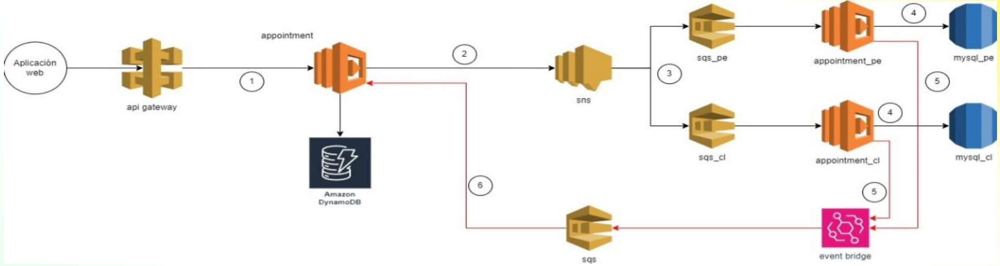

# 🏥 Medical Appointment Scheduling API

## 1. DESCRIPCIÓN DE NEGOCIO
Un asegurado desea agendar una cita médica, ingresa a la aplicación y escoge el centro médico, la especialidad, el
médico y la fecha y hora de un listado que muestra la aplicación web. Luego presiona un botón “Agendar” y los datos
son enviados a una aplicación backend que le devuelve un mensaje diciéndole que el agendamiento está en proceso.
Esta aplicación funciona tanto para Perú como Chile. El procesamiento de agendamiento es distinto por país.

## 2. OBJETIVO
Crear la aplicación backend usando AWS

## 3. DESCRIPCIÓN TÉCNICA
La petición enviada tendrá la siguiente estructura:
```
{
insuredId: string,
scheduleId: number,
countryISO: string
}
```
- insuredId: código del asegurado de 5 dígitos (puede tener ceros por delante)
- scheduleId: identificador o llave del espacio para agendar una cita. “Espacio” es el conjunto de 4 campos (centro
médico, especialidad, médico y fecha y hora).
Ejemplo:
```
{scheduleId: 100, centerId: 4, specialtyId: 3, medicId: 4, date: “2024-30-09T12:30:00Z”}
```
- countryISO: identificador de país. Solo puede ser o “PE” o “CL”

## 4. PASOS
- La petición es recibida por un lamba (appointment) que guarda la información en una tabla de
DynamoDb indicando que el estado es “pending”.
- El lambda (appointment) envía la información a un SNS. Debe haber un tópico por país
- El SNS envía la información al SQS correspondiente (si el countryISO es PE, entonces envía la SQS
llamado “SQS_PE”).
- El lambda correspondiente (appointment_pe o appointment_cl) lee la información del SQS
correspondiente y almacena la información en una base de datos mysql (RDS).
- Los lambdas (appointment_pe y appointment_cl) envían la conformidad del agendamiento a través de
un EventBridge que a su vez lo envía a un SQS.
- El lambda“appointment” lee la información del SQS del paso anterior y actualiza el estado del
agendamiento a “completed” en tabla de DynamoDB.
- El lambda“appointment” debe disponer de los siguientes endpoints:
  - Registro de la petición (paso 1)
  - Listado de peticiones por código de asegurado (insuredId) que incluya el estado de estas (insuredId
llegará como parámetro en la url).

```
1. API → appointment λ → DynamoDB (pending)
2. appointment λ → PE/CL SNS → Country SQS → PE/CL λ → MySql(RDS) (scheduled)
3. PE/CL λ → EventBridge → Completion SQS → appointment λ → DynamoDB UPDATE (completed)
```

## 5. DIAGRAMA PARA IMPLEMENTAR



## 6. INDICACIONES

- Se debe usar el framework serverless, typescript y NodeJS.
- Crear por código el API Gateway, Lambdas, DynamoDB, SNS, SQS y EventBridge.
- La aplicación backend debe tomar en cuenta los principios SOLID, un patrón de arquitectura limpia
y al menos un patrón de diseño de software.
- El modelado de la base de datos RDS y de la tabla de DynamoDB será de acuerdo con su criterio.
  - Se considera:
    - DynamoDB: Tabla `Appointments` con GSI en `insuredId` para consultas rápidas por asegurado.
    - RDS MySQL: Tabla `appointments_pe` y `appointments_cl` con columnas optimizadas para consultas frecuentes.
- Mínimo 2 endpoints, GET para recuperar la información y POST para crear un elemento.
- Documentación de uso.
- Pruebas unitarias.
- Documentación en Open API/Swagger.

## 7. CONSIDERACIONES

- Para el reto no es necesario que se haga una lógica diferente de agendamiento para cada país, aunque en la
práctica sí lo será.
- Registrar el agendamiento en la base de datos del país correspondiente es suficiente.
- El asegurado ya está registrado previamente en la aplicación backend.
- La aplicación backend enviará posteriormente un correo al cliente confirmando el agendamiento, pero este
proceso no es parte del reto.
- No es necesario que se cree la lógica en caso falle el agendamiento (una falla del sistema o el espacio del
agendamiento ya fue tomado por otro asegurado).
- No es necesario que se cree el RDS por código. Asuma que ya existe y tiene los datos de conexión (**Se creo con IaC**).
- Asuma la creación de campos extras tanto en tabla de DynamoDB como en la tabla de la base de datos RDS
- Asuma las validaciones adicionales que crea convenientes.